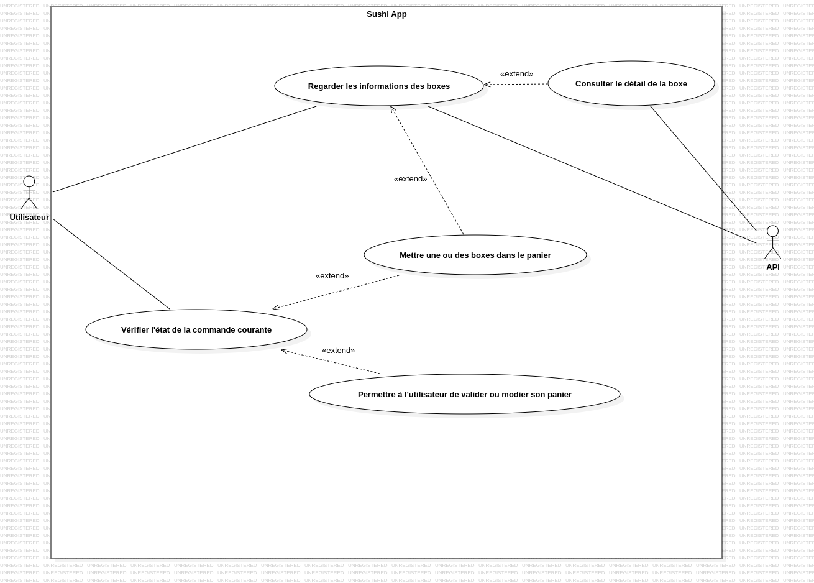
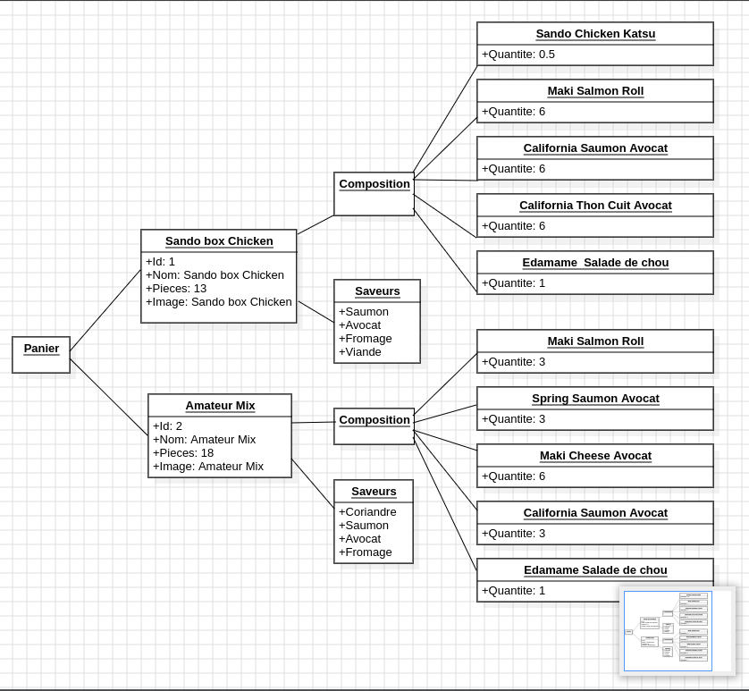
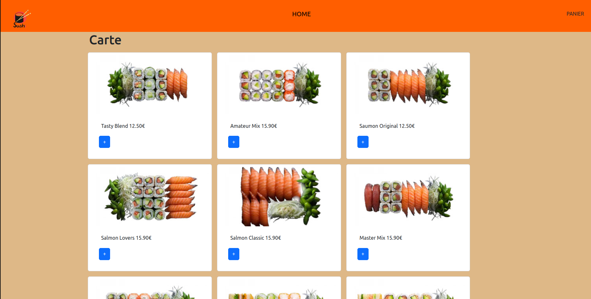
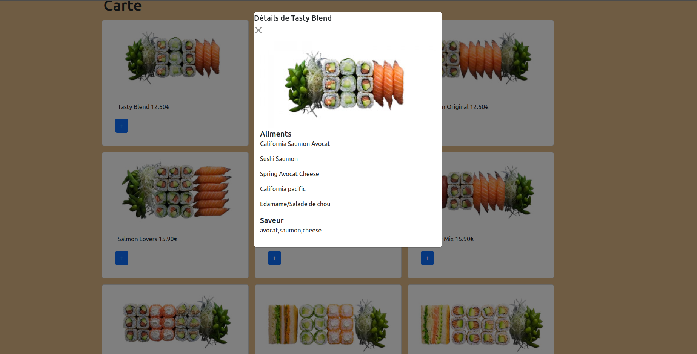
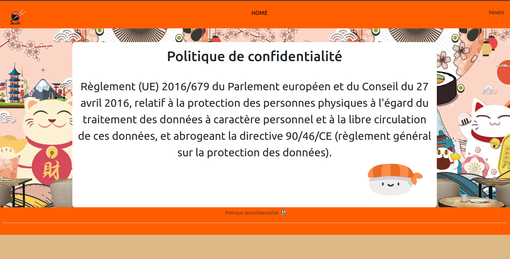
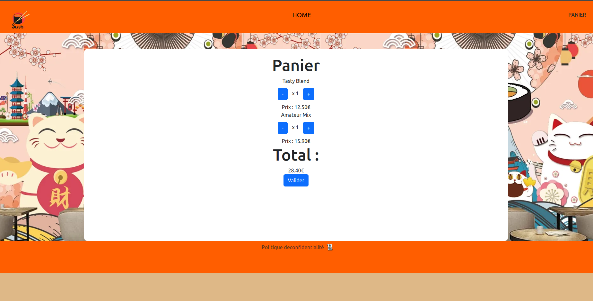
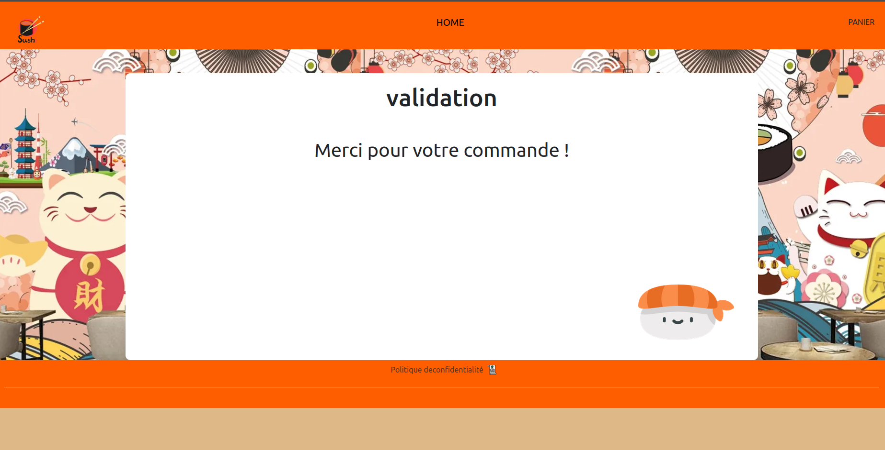

= Projet SushiFast
:toc-title: Sommaire
:toc: top

Projet réalisé par : +
TRAN Nicolas

Du 06/03/2024 au 07/04/2024

== Contexte +
Dans le cadre du projet SushiFast, nous avons utiliser le framework en Angular et d'une API afin de créer une application de commande de sushi.

== Introduction +
Pour le projet, nous nous sommes inspirés d'une maquette que nous avons réalisé sur figma. Nous avons aussi réalisé le diagramme de cas d'utilisation et le diagramme JSON.

=== Maquette +
Lien de la maquette Figma : https://www.figma.com/file/eApxfuprNF8OU5HlIO43KR/Untitled?type=design&node-id=6%3A2&mode=design&t=5zl2LdaHbOhCKr6Y-1 +

=== Diagramme de cas d'utilisation +

=== Diagramme de JSON +

== Services +

=== Service des sushi-box

Nous avons tout d'abord créé un service qui va permettre d'instancier nos box pour les utiliser sur nos pages.

[source,typescript]
export class SushiBoxService {
constructor(private http:HttpClient) { }
public Box(): Observable<any> {
let resultat =this.http.get(environment.apiBaseUrl);
console.log(resultat)
return resultat;
}
}

=== Service du panier

Nous avons ensuite créé un service qui va permettre d'instancier le panier.

[source,typescript]
export class PanierService {
  ligne: Array<Ligne>;

  constructor() {
    this.ligne =JSON.parse(localStorage.getItem("panier" )?? "[]")
  }

  getPanier() {
    return this.ligne
  }

  addLigne(uneBox:Box, qte:number) {
    let nouvelleLigne=new Ligne(qte,uneBox)
    let ligneExiste = false;
    for (let boxe of this.ligne){
      if (boxe.box.id == uneBox.id){
        boxe.quantite+=qte
        ligneExiste = true
      }
    }
    if (ligneExiste == false){
    this.ligne.push(nouvelleLigne);
  }
    localStorage.setItem("panier",JSON.stringify(this.ligne))
  }

  enleverLigne(uneBox: Box, qte: number) {
    for (let boxe of this.ligne) {
      if (boxe.box.id == uneBox.id) {
        if (boxe.quantite > 1) {
          boxe.quantite -= qte;
          localStorage.setItem("panier", JSON.stringify(this.ligne));
          return;
        } else {
          this.supprimerDuPanier(this.ligne.indexOf(boxe));
          return;
        }
      }
    }
  }

  getPrixLigne(ligne:Ligne):string{
    let lignePanier=this.ligne.find((uneLigne)=>uneLigne.box.id==ligne.box.id)!
    let prix = Number(lignePanier.box.prix)
    let resultat = prix * lignePanier.quantite
    return resultat.toFixed(2)
  }

  getPrixTotal(): string {
    let prixTotal = 0;
    for (let ligne of this.ligne) {
      prixTotal += parseFloat(ligne.box.prix.toString()) * ligne.quantite;
    }
    return prixTotal.toFixed(2);
  }

  supprimerDuPanier(index: number) {
    this.ligne.splice(index, 1);
    localStorage.setItem("panier",JSON.stringify(this.ligne))
  }
}

== Module app routing

Le module app routing permet de définir des routes pour chaque composant spécifique. Nous pouvons définir des routes pour chaque composant en l'associant avec un chemin URL.

[source,typescript]

const routes: Routes = [
{path: '', component: CarteComponent},
{path:"rgpd",component: RgpdComponent},
{path:"panier",component: CommandeComponent},
{path:"validation",component:ValidationComponent}
];
@NgModule({
imports: [RouterModule.forRoot(routes)],
exports: [RouterModule]
})
export class AppRoutingModule { }

==  Models

=== Modèle Box

Ce modèle permet de définir les box.

[source,typescript]
export class Box implements Ibox {
    constructor(
        public id: string,
        public nom: string,
        public pieces: string,
        public prix: string,
        public image: string,
        public aliments: Array<any>,
        public saveurs: string[]) {
    }
}

=== Modèle iBox

Ce modèle permet de définir l'interface des box.

[source,typescript]
export interface Ibox {
    id: string,
    nom: string,
    pieces: string,
    prix: string,
    image: string,
    aliments: Array<any>,
    saveurs: string[],
}

=== Modèle ligne

Ce modèle permet de faire plusieurs lignes dans le panier lorsqu'on commande des box différentes.

[source,typescript]
import { Box } from "./Box";
export class Ligne {
quantite: number
box:Box
constructor(quantite: number,box:Box) {
this.quantite = quantite;
this.box=box
}
}

== Les composants

=== header et footer
header
[source,html]
<header class="navbar" style="background-color: rgb(255, 94, 0); height: 100px;">
    

        
        <a class="navbar-brand mx-auto" style="margin-right: 10px; margin-bottom: 30px;" href="">HOME</a>
        <a routerLink="panier" routerLinkActive="active" class="nav-link">PANIER</a>
    

</header>

footer
[source,html]
<footer class="text-center text-lg-start" style="background-color: rgb(255, 94, 0); height: 100px;">
    

        <ul class="nav justify-content-center border-bottom pb-3 mb-3">
            <li class="nav-item"><a routerLink="rgpd" routerLinkActive="active" class="nav-link px-2 text-body-secondary">Politique deconfidentialité</a></li>
            
        </ul>
    

</footer>

=== carte.component

Le composant carte.component permet d'afficher une page avec tous les box diponible que nous pouvons ajouter dans le panier. +

Nous pouvons aussi cliquer sur les box  pour voir le détail.

[source,html]

    

        <h1>Carte</h1>
        

            

                
                

                    <ul class="list-group list-group-flush">
                        <li class="list-group-item">
                            <td>{{ box.nom }} {{ box.prix | number:'1.2-2'}}€</td>
                        </li>
                    </ul>
                    <a href="#" class="btn btn-primary" (click)="ajouter(box)"
                        style="margin: 10px;">+</a>
                

            

            

                

                    

                        

                            <h1 class="modal-title fs-5 " id="exampleModalLabel">Détails de {{detailBox?.nom}}</h1>
                            <button type="button" class="btn-close" data-bs-dismiss="modal" aria-label="close"></button>
                        

                        

                            
                            <h1 class="modal-title fs-5" id="exampleModalLabel">Aliments</h1>
                            
{{aliment?.nom }}

                            <h1 class="modal-title fs-5" id="exampleModalLabel">Saveur</h1>
                            
{{detailBox?.saveurs}}

                        

                    

                

            

        

    

résultat +

=== rgpd.component

Ce composant permet d'afficher une page sur le RGPD (Règlement Général sur la Protection des Données)

HTML
[source,html]
<!DOCTYPE html>
<html lang="fr">
<head>
<meta charset="UTF-8">
<meta name="viewport" content="width=device-width, initial-scale=1.0">
<h1>rgpd</h1>
</head>
<body>

<h1>Politique de confidentialité</h1>

Règlement (UE) 2016/679 du Parlement européen et
du Conseil du 27 avril 2016, relatif à la protection des
personnes physiques à l'égard du traitement des
données à caractère personnel et à la libre circulation
de ces données, et abrogeant la directive 90/46/CE
(règlement général sur la protection des données).
        

        

            
        

    

</body>
</html>

CSS
[source,css]
body {
    text-align: center;
    background-image: url(../../../assets/backgroundsushi.png);
}
.container {
    margin-top: 50px;
    display: inline-block;
    background-color: white;
    padding: 20px;
    border-radius: 10px;
    position: relative;
    height: 600px;
}
.image {
    position: absolute;
    bottom: 0;
    right: 0;
    margin-top: 300px;
    margin-right: 50px;
}
h1 {
font-size: 50px;
}
p {
margin-top : 50px;
    font-size: 40px;
}

=== panier.component

Ce composant permet d'afficher la page du panier. Nous pouvons ajouter ou réduire la quantité des box et nous pouvons valider la commande.

HTML
[source,html]
<!DOCTYPE html>
<html lang="fr">
<head>
<meta charset="UTF-8">
<meta name="viewport" content="width=device-width, initial-scale=1.0">
<h1>Panier</h1>
</head>
<body>

<h1>Panier</h1>

{{ ligne.box.nom }}

<button class="btn btn-primary" (click)="enlever(ligne.box,1)" style="margin: 10px;">-</button>
x {{ligne.quantite }}
<button class="btn btn-primary" (click)="ajouter(ligne.box,1)" style="margin: 10px;">+</button>

Prix : {{ prixLigne(ligne)}}€

<h1>Total : </h1>

 {{ prixTotla() }}€

<a class="btn btn-primary" href="validation" role="button"> Valider</a>

</body>
</html>

CSS
[source,css]
body {
    text-align: center;
    background-image: url(../../../assets/backgroundsushi.png);
}
.container {
    margin-top: 50px;
    display: inline-block;
    background-color: white;
    padding: 20px;
    border-radius: 10px;
    position: relative;
    height: 600px;
}
.image {
    position: absolute;
    bottom: 0;
    right: 0;
    margin-top: 300px;
    margin-right: 50px;
}
h1 {
font-size: 50px;
}
p {
margin-top : 50px;
    font-size: 40px;
}

=== validation.component

Ce composant permet d'afficher une page lorsque que nous avons confirmé la commande.

HTML
[source,html]
<!DOCTYPE html>
<htmllang="fr">
<head>
<meta charset="UTF-8">
<meta name="viewport" content="width=device-width, initial-scale=1.0">
<h1>rgpd</h1>
</head>
<body>

<h1>validation</h1>

Merci pour votre commande !

</body>
</html>

CSS
[source,css]
body {
    text-align: center;
    background-image: url(../../../assets/backgroundsushi.png);
}
.container {
    margin-top: 50px;
    display: inline-block;
    background-color: white;
    padding: 20px;
    border-radius: 10px;
    position: relative;
    height: 600px;
}
.image {
    position: absolute;
    bottom: 0;
    right: 0;
    margin-top: 300px;
    margin-right: 50px;
}
h1 {
font-size: 50px;
}
p {
margin-top : 50px;
    font-size: 40px;
}

== Conclusion

Ce projet nous a permis d'acquérir et developper nos connaisances sur TypeScript et apprendre à utiliser le framework Angular ainsi qu'une API.

